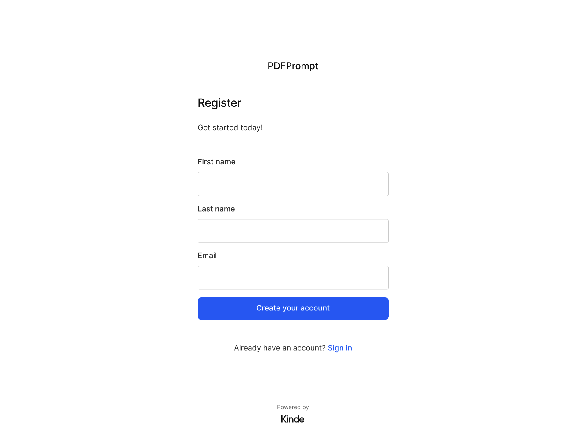
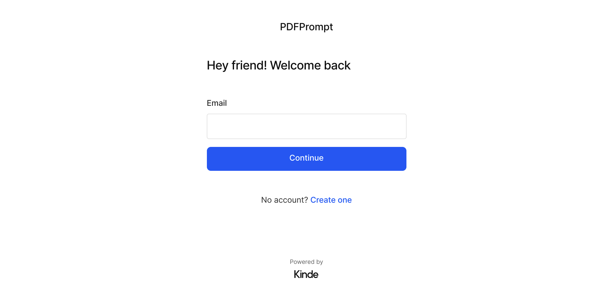
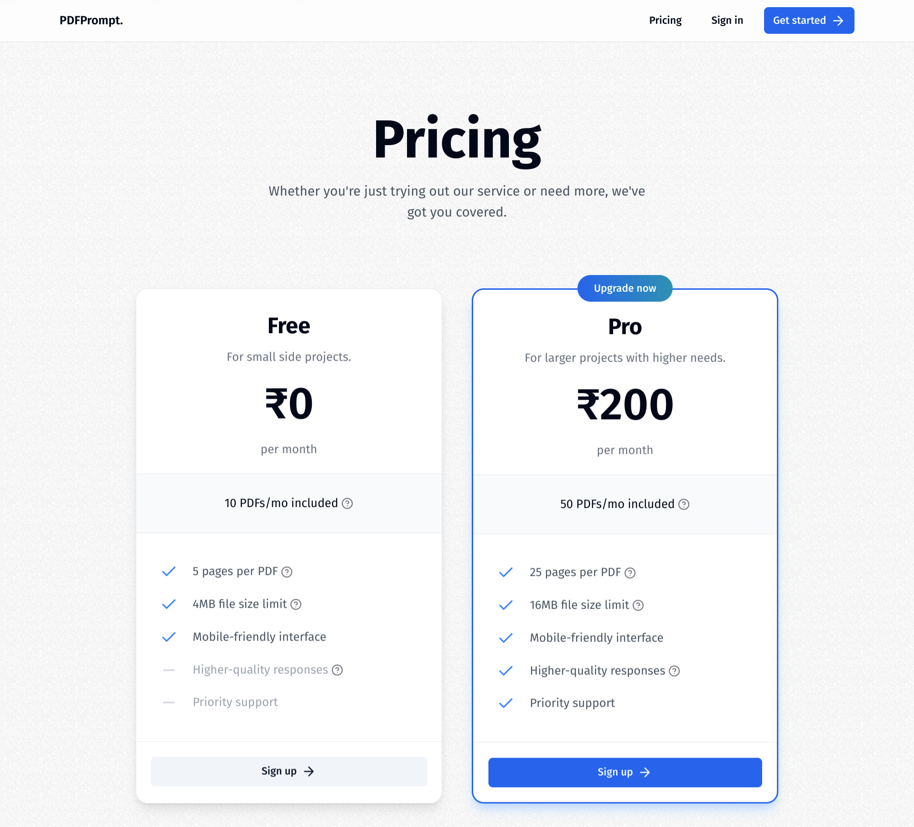
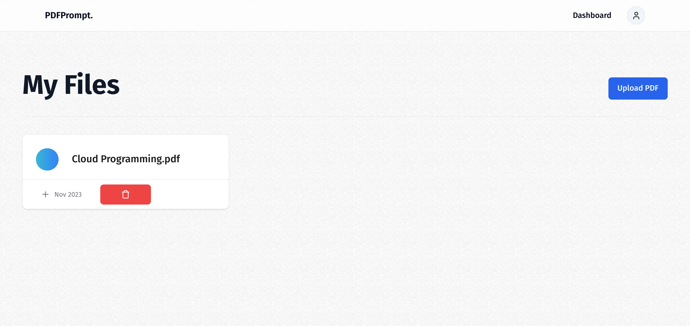
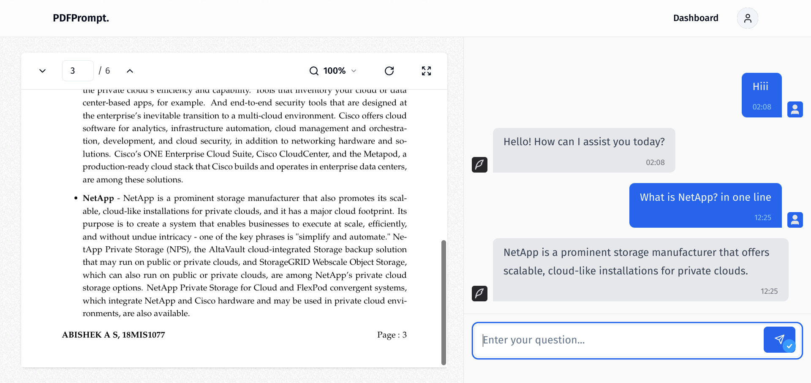
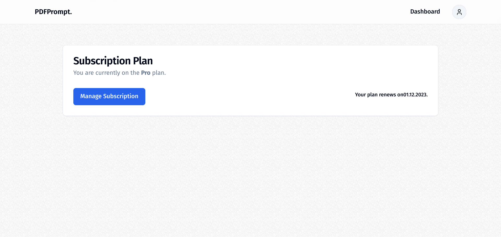
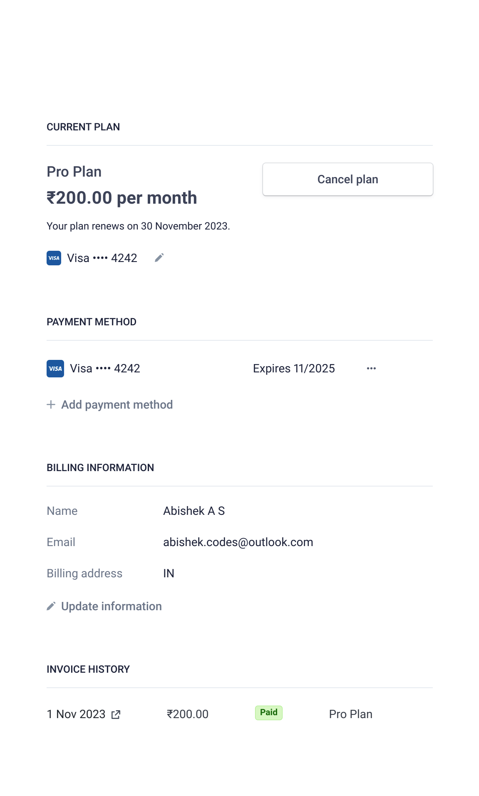

# Live app - https://pdf-prompt.vercel.app/


# PDFPrompt: Talk to Your PDFs, Get Things Done Faster

-   PDFPrompt is a revolutionary SaaS service that allows you to have conversations with any PDF document. Simply upload your file and start asking questions right away. PDFPrompt will use its powerful AI to understand your questions and provide you with accurate and informative answers.

-   Whether you're a student seeking study material insights, a researcher exploring in-depth analysis, or a professional seeking quick summaries, PDFPrompt is your go-to solution for maximizing productivity and gaining deeper understanding.

## Key Features

-   🛠️ A Full-Featured SaaS Platform Developed from Scratch
-   💻 Visually Stunning Landing and Pricing Pages Included
-   💳 Free and Pro Plans Supported via Stripe Integration
-   📄 A Stylish and Highly Functional PDF Viewer
-   🔄 Real-Time API Responses for Seamless Data Streaming
-   🔒 User Authentication Utilizing Kinde
-   🎨 Sleek and Contemporary User Interface Designed with 'shadcn-ui'
-   🚀 Optimistic UI Updates for an Enhanced User Experience
-   ⚡ Infinite Message Loading for Improved Performance
-   📤 Intuitive Drag-and-Drop File Uploads
-   ✨ Lightning-Fast Loading States
-   🔧 Modern Data Retrieval Implemented Using tRPC & Zod
-   🧠 Harnessing LangChain for Limitless AI Memory
-   🌲 Utilizing Pinecone for Efficient Vector Storage
-   ⚛️ Integration with OpenAI for AI-Powered Responses
-   📊 Prisma as Our Object-Relational Mapping Tool
-   🔤 Entirely Developed in TypeScript
-   🎁 Plus, Many More Exciting Features

### Prerequisites

**Node version 20.x**

### Cloning the repository

```shell
git clone https://github.com/abishek-as/PDFPrompt.git
```

### Install packages

```shell
npm i
```

### Setup .env file,

```js
// Auth credentials
KINDE_CLIENT_ID=
KINDE_CLIENT_SECRET=
KINDE_ISSUER_URL=
KINDE_SITE_URL=
KINDE_POST_LOGOUT_REDIRECT_URL=
KINDE_POST_LOGIN_REDIRECT_URL=

// Database URL
DATABASE_URL=

// File Storage URL
UPLOADTHING_SECRET=
UPLOADTHING_APP_ID=

// Vector Storage URL
PINECONE_API_KEY=
PINECONE_INDEX=

// Vector Storage URL
OPENAI_API_KEY=

// Payments credentials
STRIPE_PRODUCT_PRICE_ID=
STRIPE_SECRET_KEY=
STRIPE_WEBHOOK_SECRET=

// Deployment URL
VERCEL_URL=
```

### Start the app

```shell
npm run dev
```

## Images

### Sign-Up



### Sign-In



### Pricing



### Dashboard



### Chat page



### Billing Page



### Manage Subscriptions


